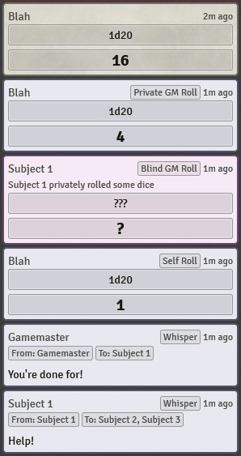

# FVTT-Chat-Message-Accessibility-Indicators

Adds a textual tag to chat messages to easily identify whether the message is a whisper, blind roll, or self roll.

## Compatibility

I can't make any promises of compatibility with modules that do custom roll cards. It should fall back to labeling private gm roll and blind roll chat cards as whispers in the case of weirdness.

## License

Licensed under the GPLv3 License (see [LICENSE](LICENSE)).
